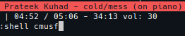
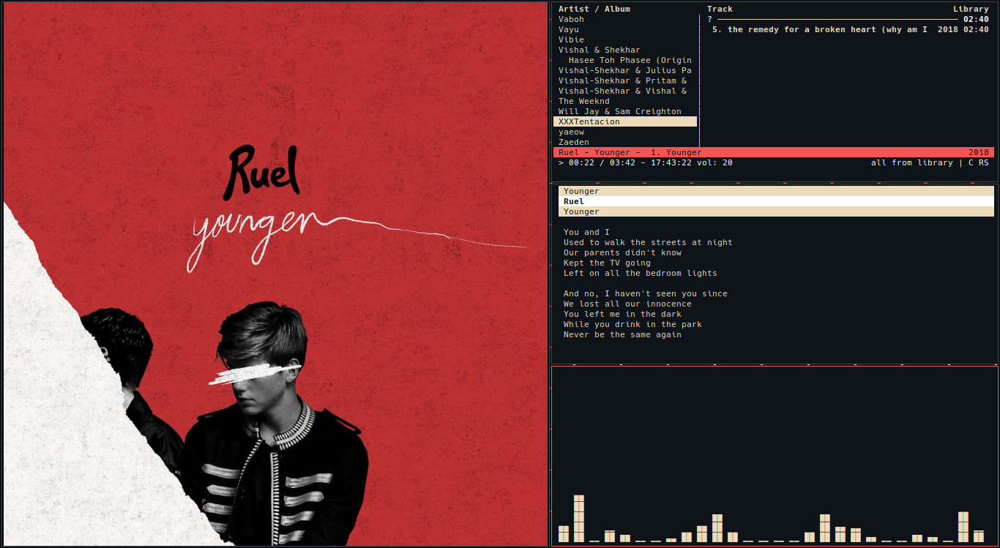

`cmusf` is a simple shell script that displays media cover/art along with other utilities when using cmus.

## Dependencies

- feh (to view image)
- ffmpeg (to fetch art from music file)
- cava (music visualiser)
- lyrics-in-terminal (to fetch lyrics)
- grep and sed (regex)

## Installation

#### GNU/Linux

   1. ```cp cmusf /usr/bin``` or ```make install ```

  > Note: Add /usr/bin/ in PATH if its not added already or copy cmusf into a 
  other directory which is in path.
  
  > Note: You may need administrator privileges

## Usage

Just enter `:shell cmusf` inside cmus, and you should be good to go.



## Screenshot


